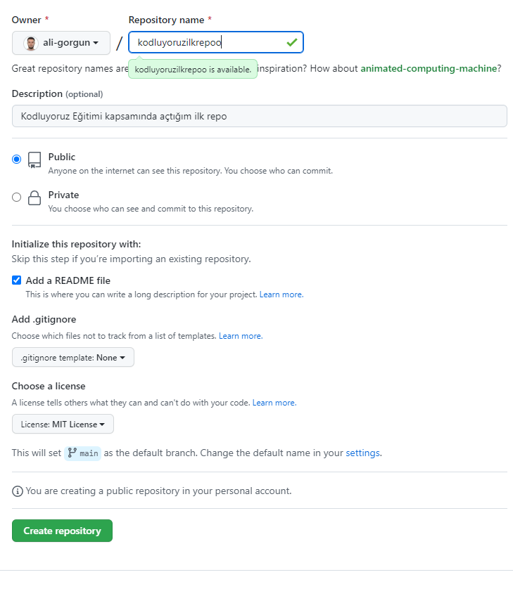

# kodluyoruzilkrepo

Kodluyoruz Eğitimi kapsamında açtığım ilk repo


 Bu repo [Kodluyoruz](https://www.kodluyoruz.org) git eğitimde oluşturduğumuz ilk repodur.İçerisinde bir adet "README" dosyası ve bir adet "index.html" barındırıyor.





## Installation

```bash
git clone (https://github.com/ali-gorgun/kodluyoruzilkrepo.git)
```


## Usage

Linux için:
```linux
cd kodluyoruzilkrepo
code .
```

## Contributing

Pull requestler kabul edilir. Büyük değişiklikler için, lütfen önce neyi değiştirmek istediğinizi tartışmak için bir konu açınız.


## License

[MIT](https://choosealicense.com/licenses/mit/)
